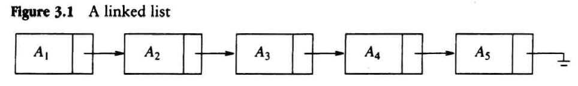

# 表(list)

除了空表, $A_{i + 1}$被称为`跟随(follow)`或`继承(success)`自$A_{i}$,
$A_{i - 1}$被称为`领先(predecess)`与$A_{i}$. 对于一个长度为$N$的表,
$A_{1}$的`前任(predecessor)`以及$A_{N}$的`继承者(successor)`是没有定义的.

## 以数组方式实现

以数组方式实现的话(无论是静态分配空间还是动态分配), 都需要对数组的大小进行大量的高估
(或预先知道所需数组的大小),这会造成大量的空间浪费;
并且在首位插入一个新元素会导致后续的所有元素都向后移位, 在最坏情况会导致$O(N)$的复杂度, 
对于删除操作同样会造成巨大的时间开销.

## 链表(linked list)

链表由特定结构体(structure)组成的结构, 结构体包括`元素(element)`以及
`指向下一个结构体的指针(Next pointer)`组成.

执行`PrintList, Find`操作时, 只需要按照`Next pointer`进行遍历即可,
但对于`FindKth`操作, 相比于使用数组实现的表所花费的时间更多, 会花费$O(i)$的时间;
但在实践中, 调用该函数通常会先依$i$进行排序再调用该函数, 所以实际遍历一次就可以完成.

`Delate, Insert`通过更改指针指向就可以实现.

在链表的实践过程中, 在删除时某一个节点时我们需要对被删除节点的前一个节点保持跟踪,
并且在删除首节点时是一个特殊情况, 通常可以设定一个`哨兵(sentinel)`节点, 
也被称为`表头(header), 哑节点(dummy node)`, 在链表中通常被定义为第0个节点.

递归的实现`Find`通常是为了避免粗心的结束条件, 但这种实现方式仍然是一个非常糟糕的实现方式.

之前提到的,除了`Find, FindPrevious`以外所有的操作都是$O(1)$的复杂度, 
那两个操作在最坏情况是$O(N)$的复杂度, 并且平均花费的时间也是$O(N)$, 
因为平均下来至少一半的元素会被访问.
