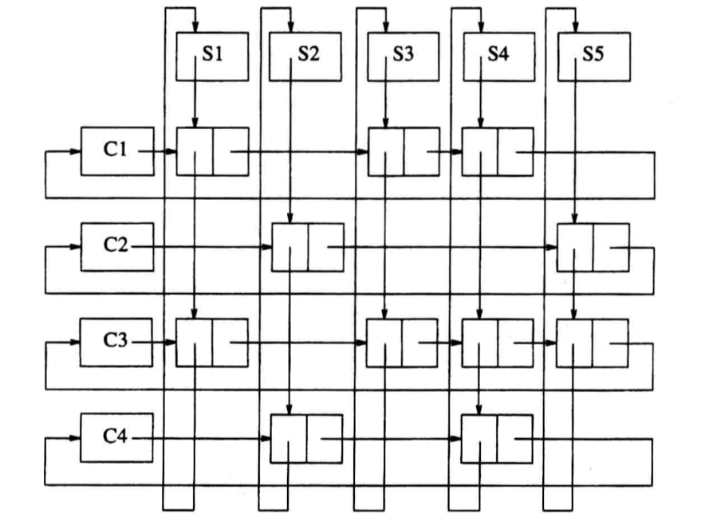

# 表(list)

除了空表, $A_{i + 1}$被称为`跟随(follow)`或`继承(success)`自$A_{i}$,
$A_{i - 1}$被称为`领先(predecess)`与$A_{i}$. 对于一个长度为$N$的表,
$A_{1}$的`前任(predecessor)`以及$A_{N}$的`继承者(successor)`是没有定义的.

## 以数组方式实现

以数组方式实现的话(无论是静态分配空间还是动态分配), 都需要对数组的大小进行大量的高估
(或预先知道所需数组的大小),这会造成大量的空间浪费;
并且在首位插入一个新元素会导致后续的所有元素都向后移位, 在最坏情况会导致$O(N)$的复杂度, 
对于删除操作同样会造成巨大的时间开销.

## 链表(linked list)

链表由特定结构体(structure)组成的结构, 结构体包括`元素(element)`以及
`指向下一个结构体的指针(Next pointer)`组成.


执行`PrintList, Find`操作时, 只需要按照`Next pointer`进行遍历即可,
但对于`FindKth`操作, 相比于使用数组实现的表所花费的时间更多, 会花费$O(i)$的时间;
但在实践中, 调用该函数通常会先依$i$进行排序再调用该函数, 所以实际遍历一次就可以完成.

`Delate, Insert`通过更改指针指向就可以实现.

在链表的实践过程中, 在删除时某一个节点时我们需要对被删除节点的前一个节点保持跟踪,
并且在删除首节点时是一个特殊情况, 通常可以设定一个`哨兵(sentinel)`节点, 
也被称为`表头(header), 哑节点(dummy node)`, 在链表中通常被定义为第0个节点.

递归的实现`Find`通常是为了避免粗心的结束条件, 但这种实现方式仍然是一个非常糟糕的实现方式.

之前提到的,除了`Find, FindPrevious`以外所有的操作都是$O(1)$的复杂度, 
那两个操作在最坏情况是$O(N)$的复杂度, 并且平均花费的时间也是$O(N)$, 
因为平均下来至少一半的元素会被访问.

## 双向链表(double linked list)

相比于前一节中的单向链表, 双向链表在结构中增加了一个指向前一项的指针,
这导致双向链表在`插入`和`删除`时花费双倍的时间, 但同时双向链表简化了删除操作.

## 循环链表(circularly linked list)

循环链表是将链表中最后一个项中指向下一项的指针赋值为链表中的第一项(有哑元则指向哑元),
也可以使用双向链表实现, 将链表中第一项的指向前一项的指针赋值为链表中的最后一项.
循环链表在某些应用场景中是比较流行的.

## 例子

1. 表示单变量多项式
2. 在某些情况下实现线性时间排序
3. 链表在跟踪学生课程注册问题中的应用

### 例1

对于单变量多项式来说, 可以简单地使用下面的结构进行实现:

```C
typedef struct
{
int CoeffArray[ MaxDegree + 1 ];
int HighPower;
} * Polynomial;
```

这种方式对于稠密多项式(大部分次数项存在)的乘法来说是可以接受的,
但是对于其他的多项式会花费大量的时间去乘零系数.

使用链表的实现方式可以使用下面的结构:

```C
typedef struct Node* PtrToNode;
struct Node
{
int Coefficient;
int Exponent;
PtrToNode Next;
};
typedef PtrToNode Polynomiel;
```

### 例2

例子2是链表在`基数排序`和`桶排序`上的应用. 

- 桶排序: 
假设存在一组数字, 一组中有`N`个数字, 并且知道这组数字的范围为0到M,
那么创建一个长度为M的数组`Count`, 并初始化为0, 对这组中每个数字$A_i$进行遍历, 每次对`Count[A_i]`加1.
这样遍历一次后按顺序显示即为排序完成的结果, 时间复杂度为$O(M + N)$(M是初始化`Count`时花费的时间, 
N是遍历这组数字花费的时间), 空间复杂度为$\Theta(M)$.

- 基数排序: 
基数排序是桶排序的一个推广, 假设一组$N$个数字的范围可以表示为0到$k^p - 1$,
那么空间复杂度为$O(k + N)$(可以理解为N是由数组使用的空间, k为桶的数量, 每次将数字放到桶中,
之后按照从前到后的顺序再将桶中的数据覆盖回数组), 
时间复杂度为$O(p(k + N))$(可以理解为进行P次桶排序,每次需要访问桶大小N加上上一次排序后的结果).

### 例3

例子3是`多重表(multilists)`, 我们希望可以列出一个学生注册的所有课程以及一个课程中的所有学生,
对于有非常多课程以及学生时, 如果每个学生和课程都有列表去对应彼此, 那么会花费大量的空间,
为了节省空间可以采用`多重表`来实现这个需求,结构如下:



其中每个节点中包含指向下一个学生注册该课程所产生节点的遍历课程用的指针, 
以及下一个课程包含学生所产生的节点的遍历学生用的指针.

但是这种结构有一个假定, 就是每个课程注册的学生相对较少且学生注册的课程相对较少,
每次通过课程查学生时, 需要横向遍历直到遇到课程链表的头, 
并在每个节点纵向遍历直到遇到学生链表的头(header)才能知道课程包含的学生的姓名,
为了解决这个问题可以通过在每个节点中添加一个指向学生头和课程头的指针,
这样以空间换取时间.
