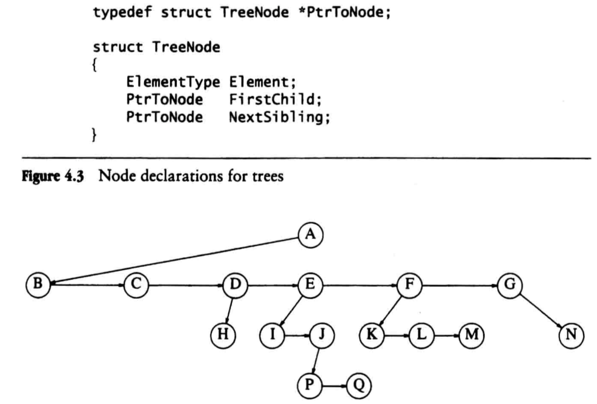
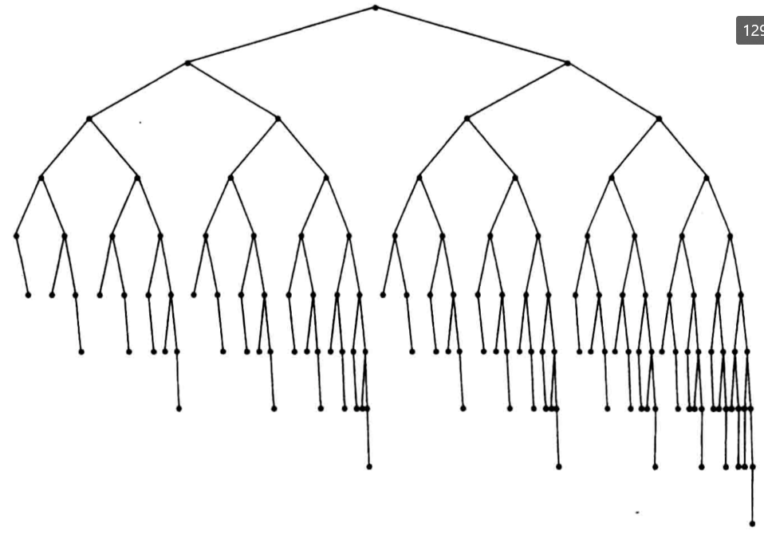
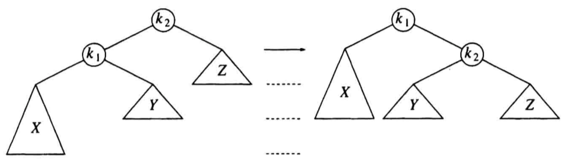
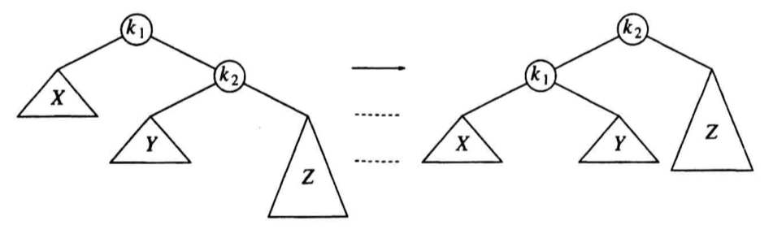

# 树(Tree)

## 预备知识

树中有`N`个`节点(Node)`, 则有`N - 1`个`边(edge)`连接这些节点.
对于没有`儿子(child)`的节点被称为`叶(leaves)`, 
拥有同一个`父亲(parent)`的节点被称为`兄弟(siblings)`.
如果一条`路径(path)`为从$n_1$到$n_k$, 并且顺序为$n_1, n_2, ..., n_k$,
那么$a_k-1$为$a_k$的父亲, 并且该路径的长度则为连接这些节点的边的数量`k-1`,
对于每一个节点都存在一个路径长度为0的边连向自己.

对于每一个节点来说, 从`根(root)`到该节点的路径是唯一的, 
那么该节点的`深度(depth)`就等于根到该节点的路径长度, 
根的深度就为0; 
`高度(height)`是一个节点到叶的最长路径, 根的深度等于树的深度.

如果存在一个路径a1到a2
(由于每个节点都有一条连接自己长度为零的边, 所以这种语境包含长度大于等于零的边), 
那么a1是a2的`祖先(ancestor)`, a2是a1的`后裔(descendant)`,
而且如果$a1 \neq a2$
(此时可以认为去掉了边长为零的边), 
那么a1是a2的`真祖先(proper ancestor)`,
a2是a1的`真后裔(proper descendent)`.

### 树的实现

在树中, 兄弟节点之间通过链表链接, 对于每个节点都有指向子节点和兄弟节点的指针.



### 应用

在Unix文件系统中, 一个文件夹也是一个文件, 不过该文件中记录有指向其他文件的指针,
这样的话就可以将文件系统看成是一个树的结构.

## 二叉树(Binary Trees)

### 介绍

二叉树是树的一种, 每个几点只能有不超过两个儿子.
在二叉树中很重要的一个性质是`平均二叉树(average binary tree)`的深度远小于N, 
其`平均深度`为$O(\sqrt{N})$.
对于`二叉查找树(binary search tree)`其`平均深度`为$O(\log{N})$.

### 实现

由于二叉树最多只有两个子节点, 那么可以通过结构体实现每个节点.
```c
struct Node
{
	ElementType val,
	Ptr2Node LeftNode,
	Ptr2Node RightNode
};
typedef Node* Ptr2Node;
```

### 表达式树

在编译器设计上就应用到了二叉树, 也就是表达式树.
每一个操作数在被存储在一个叶中, 在其他节点中存储有操作符,
对于每个节点所需要做的就是递归的计算出左树和右树的结果, 
之后使用根的操作符对左树和右树的结果进行计算.

根据遍历树的方式不同, 获得不同类型的表达式:
|遍历方式|顺序|表达式类型|
|:---:|:---:|:---:|
| 中序(inorder) | 左树, 根, 右树 | 中缀(infix) |
| 先序(preorder) | 根, 左树, 右树 | 前缀(prefix) |
| 后续(postorder) | 左树, 右树, 根 | 后缀(postfix) |

### 实现

对后缀表达式构建表达式树与之前说过的后缀表达式转中缀表达式的方法类似,
差别在于存储在栈中的内容变为了指针, 指针指向表达式中的每个内容;
并且将弹出的内容不是显示出来, 而是用于构建树, 
先被pop的为右节点, 后被pop的为左节点, 操作符为根节点.

## 查找树ADT---二叉查找树(binary search tree)

二叉查找树与二叉树的不同点在于:
二叉查找树中任意节点的左子树中所有的节点值均小于该节点中的值,
右子树中所有节点的值均大于该节点的值.

### 实现

二叉查找树一般是通过递归的方式实现的,
因为该树的`平均深度`为$O(\log {N})$, 所以通常不需要担心导致栈溢出,
并且在使用这种树时有一个前提, 就是节点中的值可以以某种方法比较,
因为通过上述定义可以看出, 在树中的元素是以一种固定的方式排列的.

#### Find

查找可以通过递归或者循环的方式实现,
对于递归实现来说, 需要注意基准情况的处理,
也就是说在查找到元素值相同的节点时返回指向该节点的指针,
在没有找到时返回空指针, 
并且还需要注意按照二叉查找树的特性来进行查找.

#### Insert

插入通常是使用递归的方式实现的.

#### Delete

对于树来说删除操作是最为困难的一种操作,
如果被删除的是个叶直接删除即可;
如果被删除的是个节点但只有一个儿子的话, 可以通过将儿子给到父节点,
再删除该节点就可以了;
问题是如果该节点有两个儿子的时候.

在被删除的节点有两个儿子时, 

- 一种通常的做法是将被删除节点中的内容使用右子树中最小的值替代,
之后删除右子树中的最小值节点.

- 另一种做法被称为`懒惰删除(lazy deletion)`, 通常懒惰删除应用在有重复键值出现的情况,
此时每个节点会包含有一个区域用以记录重复次数, 懒惰删除并不真正删除节点, 
而是将节点中记录重复次数的变量减一. 
这样虽然会在重复次数为零时增加不必要的深度
(一个很小的常数, 因为二叉查找树的深度为$O(\log{N})$, 所以即使有N个无效的节点也才增加$O(\log{N})$的深度),
但是当重复键值再次出现时, 可以省下再次分配空间的时间.

### 平均情况分析

定义一颗树所有节点的深度的总和为`内部路径长(internal path length)`. 
对于一个树来说, 其内部路径长为左树的内部路径长与右子树的内部路径长之和,
再加上`N - 1`.

因为根的深度为0, 假设左子树有`i`个节点,
其内部路径长为`D(i)`, 意为有`i`个节点的树的内部路径长; 
则右子树有`N - 1 - i`个节点, 内部路径长为`D(N - 1 - i)`;
那么左子树的`平均内部路径长(average internal path length)`为$\frac{1}{N} \sum_{j=0}^{N-1}{D(j)}$, 
总的平均内部路径长为$\frac{2}{N} \sum_{j=0}^{N-1}{D(j)} + N - 1$.

最终可以得到平均内部路径长$D(N) = O(N \log N)$( 具体的证明会在第七章说明 ), 
那么一个节点的`平均深度`为$O(\log N)$.
***(这一小节的内容并不理解)***

但是实际情况中插入和删除不是完全随机的, 插入和删除操作数量不一定对等,
并且删除操作的实现方式, 这样会导致整个树偏产生偏向, 
导致平均深度变深, 进而使对树的操作开销增大.

## AVL树

为了解决实际情况中树偏向一边导致节点过深的问题,
在二叉查找树的基础上使用`平衡(balance)`机制防止节点过深的一种基础的平衡查找树(balanced search tree), 
`AVL树(Adelson-Velskii and Landis tree)`.

对于平衡情况来说, 树的`高度`应为$\log N$; 平衡最简单的一个想法就是保持左子树和右子树深度相同, 
这种情况不强制要求树要浅; 另一种平衡是要求每一个节点的左右子树深度相同, 
这样的话需要$2^{k} - 1$(k代表层数)个节点才可以满足该条件, 这种条件太过于严苛;

AVL树就相当于是二叉查找树加上了一个相对不那么严苛的平衡要求:
`每个节点的左右子树的高度差不能大于1`.
AVL树的`高度`最多大约为$1.44\log(N+2) - 1.328$,
但实际使用过程中其`高度`稍大于$\log(N)$.



这是张高度为9的AVL树, 左子树的高度为7, 右子树的高度为8,
这两个高度是该高度AVL树的最小高度( 这点根据AVL树的定义, 没有任何疑问 ), 
假设AVL树的高度和节点数量的关系符合函数$S(h)$, 可以得到$S(h) = S(h-1) + S(h-2) + 1$, 
又由于$S(0) = 1$, $S(1) = 2$, 那么可以知道该高度函数与斐波那契数高度相关,
上面的深度边界就是由斐波那契数推出来的.
( 写这个例子的目的是为了说明: 一个公式可以由一个极端情况下的具体例子抽象而来 ).

由于树的操作大部分都与树的深度有关, 那么也就是说AVL树大部分操作能在$O(\log(N))$的复杂度内完成, 
但是由于AVL树的特性( 高度差小于等于1 )导致插入操作有可能打破该特性, 
那么就在打破的时候需要进行修正, 一种简单的纠正方式叫做`旋转(rotation)`.

假设有一个AVL树已经处于平衡状态, 那么假如插入一个元素导致需要对$\alpha$节点进行`再平衡(rebalance)`,
那么会出现以下集中破坏平衡的情况:

- $\alpha$的左子树的左树
- $\alpha$的左子树的右树
- $\alpha$的右子树的左树
- $\alpha$的右子树的右树

这四种情况可以简化为两种情况:

- $\alpha$外侧( 左左, 右右 )
- $\alpha$内侧( 左右, 右左 )

对于外侧情况, 可以使用`单旋(single rotation)`;
对于内侧情况, 可以使用`双旋(double rotation)`.

### 单旋(single rotation)



根据上图, $k_1$节点的左子树在一次插入操作后导致$k_2$节点失去平衡, 
对于现在这个情况, 有两种选择:

- 加高$Z$( 无法实现, 需要向$Z$中添加元素 )
- 降低$Z$

那么就只有一种方法, 降低$k_1$, 由于$Y$在树中的一个位置, 我们可以知道$Y$大于$k_1$小于$k_2$,
那么$Y$就可以放到$k_2$的左树, 又因为$k_2$大于$k_1$, 那么$k_2$可以作为$k_1$的右树,
这样就降低了$Z$的高度.



同理, 外侧情况是镜像问题, 也可以使用单旋的方式实现再平衡
( 需要注意每次再平衡后需要更新每个结点的高度信息, 并且单旋针对的是平衡被破坏的节点 ).
