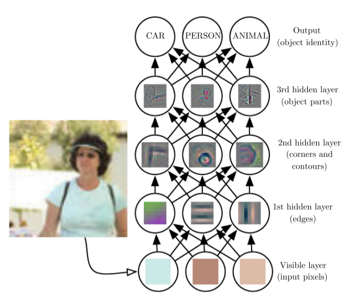
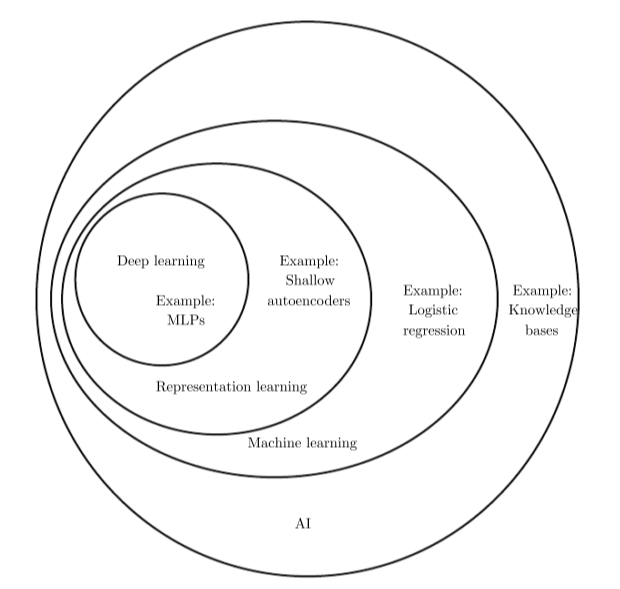
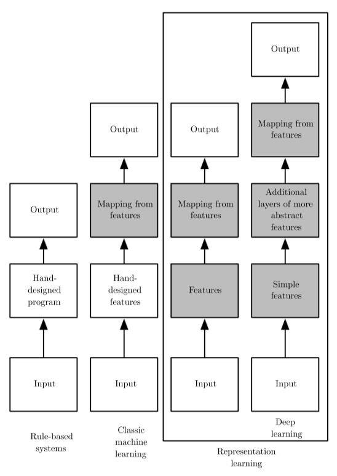

<!-- vim-markdown-toc GFM -->

* [介绍1](#介绍1)
	* [何为深度学习](#何为深度学习)
	* [基于知识的方法](#基于知识的方法)
	* [机器学习（machine learning）](#机器学习machine-learning)
		* [表示学习（representation learning）](#表示学习representation-learning)
		* [差变因素（factors of variation）](#差变因素factors-of-variation)
			* [个人理解](#个人理解)
		* [深度学习对问题的解决](#深度学习对问题的解决)
	* [他们间的关系](#他们间的关系)

<!-- vim-markdown-toc -->

# 介绍1

## 何为深度学习

描述不同概念如何构建在不同概念之上的图，
并且层数多且深，称为 **深度学习**（deep learning）。

## 基于知识的方法

使用逻辑推断规则去推断情况，
这被称为 **基于知识的方法**（knowledge baesd approach）。
例如人为硬编码出一套规则输入给机器，机器根据规则判断语义。

## 机器学习（machine learning）

能够从原始数据中提取模式的能力，称为 **机器学习** 。
一个基本的机器学习算法叫 **逻辑回归** 。
另一个基本的机器学习算法叫 **朴素贝叶斯** 。
这些简单的机器学习算法重度依赖于所给数据的 **表示**（representation）。
简单的做法是设计好特征，之后通过机器学习处理，
学习到结果的映射关系。

### 表示学习（representation learning）

不光使用机器学习实现映射，并且学习表示本身，称为 **表示学习** 。

### 差变因素（factors of variation）

难以量化但却影响结果的因素。
这些因素通常作为一种观念或者抽象使我们对一些变量很多的数据进行思考，
具体来说可能是对其影响因素进行考虑。

#### 个人理解

对可能影响结果的原因进行一些直觉上的分析。

### 深度学习对问题的解决

深度学习通过引入一个基于其他更简单的表示的表示解决了
表示学习难以express差变因素表示的问题。
这使计算机可以通过一些简单的概念得到复杂的概念。

该网络是一个典型的前向反馈深度网络
或者说是 **多层感知机**（multilayer perceptron)，
多层感知机本质是数学函数对输入到输出的映射。

## 他们间的关系

