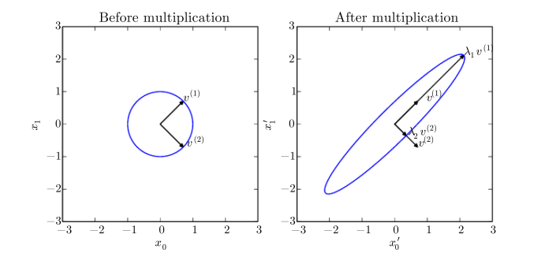

# 线性代数

## 范数

$$
||x||_{p} = (\sum_{i}^{} |x_{i}|^{p})^{\frac{1}{p}} 
$$ 

称为$L^{p}$范数, 更严格地说，
范数是指一个满足以下几个条件的函数：

- $f(x) = 0 \implies x = 0$
- $f(x + y ) \le f(x) + f(y)$（三角不等式） 
- $\forall \alpha \in \R, f(\alpha x) = |\alpha| f(x)$

还有一种范数叫做$L^{\infty}$, **最大范数（max norm）**，
就是将向量中的最大元素的绝对值作为结果。

$$
\|x\|_{\infty} = \max_{i}\left| x_{i} \right|
$$ 

在深度学习中用来衡量矩阵大小一种常用方法是 **Frobenius 范数**。

$$
\|A\|_{F} = \sqrt{\sum_{i, j}^{} A^2_{i, j}} 
$$ 

## 特征分解

特征向量是一个非零向量，并且满足：

$$
A v = \lambda v
$$ 

对应的特征分解形式为：

$$
A = V \operatorname{diag} (\lambda)V^{-1}
$$ 

这样相当于$A, v$相乘达到了对$v$进行拉伸的效果，
并且对$v$拉伸后其特征值不变，那么在后面的讨论中就只针对单位特征向量就行了。

假设$u$是单位向量所指向点的集合，如下左图篮圈所示，
$A$的特征向量为$v^{(1)}, v^{(2)}$ ，那么如果进行$Au$，
则相当于对$u$中的点在$v^{(1)}, v^{(2)}$方向进行了拉伸，
因为单位向量所指向的点集可以由两个特征向量进行表示。
就会产生下右图的效果。

## 奇异分解

奇异分解也是一个能够描述矩阵特性的分解方式，
但是适用范围更广，能够奇异分解的不一定能够进行特征分解。

奇异分解可以表示为：

$$
A = UDV^{\mathrm{T}}
$$ 

其中$A$为$m \times n$;
$D$为$m \times n$的对角矩阵，但不一定是方阵，对角的元素为奇异值；
$U$为$m \times m$的列向量由左奇异向量组成，
$V$为$n \times n$的列向量由右奇异向量组成,
$U, V$需要为正交矩阵。

左奇异向量可以由$AA^{\mathrm{T}}$的特征向量得到，
右奇异向量可以由$A^{\mathrm{T}} A$的特征向量得到，
$A$的非零的奇异值可以通过$AA^{\mathrm{T}}$或$A^{\mathrm{T}}A$的特征值的开根得到。

## Moore-Penrose伪逆

逆矩阵只针对方针，对于其他情况是没有定义的，
那么在解$Ax = y$时希望通过一个左逆矩阵$B$完成$x = By$来解方程组。

但是由于$A$的结构问题，当$A$高大于宽时,可能没有解;
当宽大于高时，可能有无数解。

**Moore-Penrose** 可以让我们在这种情况下应对这个问题，
A的定义为：

$$
A^{+} = \lim_{\alpha \to 0}(A^{\mathrm{T}}A + \alpha I)^{-1} A^{\mathrm{T}} 
$$ 

在实际计算中则采用的是下面的定义：

$$
A^{+} = VD^{+}U^{\mathrm{T}}
$$ 

其中$U, D, V$是$A$的奇异分解，$D^{+}$是对$D$的非零元素取导数后，再进行转置得到的。

当列数大于行数时，可以选择伪逆中的任何一种可能去解，
其中当使用$x = A^{+}y$时，可以得到最小的$\|x\|_{2}$。

当行数大于列数时，有可能无解。
在这种情况下，使用伪逆得到的$x$可以使得$Ax$尽可能接近$y$即
$\|Ax - y\|_{2}$最小。

## 迹

迹有很多有用的性质，或者可以通过迹来表示一些难以表示的等式：

$$
\|A\|_{F} = \sqrt{\operatorname{Tr} (AA^{\mathrm{T}})} \\
\operatorname{Tr}(A) = \operatorname{Tr}(A^{\mathrm{T}})
$$

在调换顺序相乘后结果仍有定义的前提下，还有下面的性质：

$$
\operatorname{Tr}(ABC) = \operatorname{Tr}(CAB) = \operatorname{Tr}(BCA)   
$$ 

将上式进行推广：

$$
\operatorname{Tr}(\prod_{i = i}^{n}F^{(i)}) 
= \operatorname{Tr}(F^{(n)} \prod_{i = 1}^{n - 1}F^{(i)})
$$ 

## 主成分分析

假设当前有 $m$ 个点，每个点都是 $\R^{n}$ 内的，
该点集表示为 $\{x^{(1)}, x^{(2)}, ...,x^{(m)}\}$ ，
如果我们想要对这组点进行有损压缩，并且尽可能减少精度的损失，
一种方法是将 $x^{(i)} \in \R^{n}$ 的点以更低的维度 $l$ 表示。

也就是找到一个函数 $f$ 可以将 $x$ 映射到低纬度的点 $c$ 上，
并且有另一个函数 $g$ 可以将此过程逆过来：

$$
f(x) = c \\
g(c) \approx x
$$

使用矩阵进行表示：

$$
g(c) = Dc
$$ 

其中 $D \in \R^{n \times l}$ 为一个矩阵，以实现逆过程（解码）。
为了使正过程（编码）更方便，需要使 $D$ 的列向量之间保持正交。

为了保证单个点编码后的$c^{*}$进行解码后的精度，
可以通过一个范数来衡量其与原始点$x$的距离：

$$
c^{*} = \mathop{\operatorname{argmin}} \limits_{c} \|g(c) - x\|_{2} 
$$ 

上面的问题可以等价的转换为 **平方$L^2$范数** ，
一来他们的目标一致，都是最小化后式；
二来可以减少开根的计算。

$$
c^{*} = \mathop{\operatorname{argmin}} \limits_{c} \|x - g(c)\|_{2} ^{2} \\

\begin{aligned}

&\|x - g(c)\|_{2} ^{2} \\
&= (x - g(c))^{\mathrm{T}}(x - g(c))\\
&= x^{\mathrm{T}}x - x^{\mathrm{T}}g(c) - g(c)^{\mathrm{T}}x + g(c)^{\mathrm{T}}g(c)\\
&= x^{\mathrm{T}}x - 2 x^{\mathrm{T}}g(c) + g(c)^{\mathrm{T}}g(c)\\

\end{aligned}
$$

$$
\begin{aligned}

&c^{*} = \mathop{\operatorname{argmin}} \limits_{c} (-2x^{\mathrm{T}}x + g(c)^{\mathrm{T}}g(c))\\
&= \mathop{\operatorname{argmin}}\limits_{c} (-2x^{\mathrm{T}}Dc + c^{\mathrm{T}}D^{\mathrm{T}}Dc)

\end{aligned}
$$ 

为了使$c^{*}$有唯一解，令$D$的列向量为单位向量，
再加上之前令其列向量之间正交。

$$
\begin{aligned}
& c^{*} = \mathop{\operatorname{argmin}} \limits_{c} (-2x^{\mathrm{T}}Dc + c^{\mathrm{T}} I_{l}c) \\
&  = \mathop{\operatorname{argmin}} \limits_{c} (-2x^{\mathrm{T}}Dc + c^{\mathrm{T}}c)
\end{aligned}
$$ 

此时$c$可以就相当于一个变量，后式就相当于一个函数：

$$
\begin{aligned}

\nabla_{c} (-2x^{\mathrm{T}}Dc + c^{\mathrm{T}}c) = 0\\
-2D^{\mathrm{T}}x + 2c = 0\\
c = D^{\mathrm{T}}x\\
r(x) = DD^{\mathrm{T}}x

\end{aligned}
$$ 

上面分析的结果可以知道，
一个点和其解码后的点的距离只要满足上式就可以最小，即最精确，
但对于每一个点不可能都使用一个单独的$D$，
所以就要保证一个通用的$D$对所有点的总误差最小。

$$
D^{*} = \mathop{\operatorname{argmin}} \limits_{D} \sqrt{\sum_{i, j} (x_{j}^{(i)} - r(x^{(i)})_{j})^2}  
$$ 

上式可以看作是由解码向量与原始向量之差组成的矩阵，
之后应用了forbenius范数来衡量整个矩阵的大小，
即衡量解码和原始向量整体的距离。

现在将问题简化，设$l =  1$，那么此时$D$就变为$d$一个向量。

$$
\begin{aligned}

& d^{*} = \mathop{\operatorname{argmin}} \limits_{d} \sqrt{\sum_{i}^{} (x^{(i)} - dd^{\mathrm{T}}x^{(i)})^2}\\
& 简化为= \mathop{\operatorname{argmin}} \limits_{d}\|x^{(i)} - d^{\mathrm{T}}x^{(i)} d\|_{2}^2\\
& 或= \mathop{\operatorname{argmin}} \limits_{d}\|x^{(i)} - x^{(i)^{\mathrm{T}}} d d \|_{2}^2

\end{aligned}
$$ 

将上式最后一个以矩阵的形式表示，而不是继续使用离散的向量表示，可以得到：

$$
\begin{aligned}
	
&d^{*} = \mathop{\operatorname{argmin}} \limits_{d} \|X - Xdd^{\mathrm{T}}\|_{F}^{2} \\
& = \mathop{\operatorname{argmin}}\limits_{d} \mathop{\operatorname{Tr}}((X - Xdd^{\mathrm{T}})^{\mathrm{T}} (X - Xdd^{\mathrm{T}})) \\

& = \mathop{\operatorname{argmin}} \limits_{d} \mathop{\operatorname{Tr}}(X^{\mathrm{T}}X - X^{\mathrm{T}}Xdd^{\mathrm{T}} - dd^{\mathrm{T}}X^{\mathrm{T}}X + dd^{\mathrm{T}}X^{\mathrm{T}}Xdd^{\mathrm{T}}) \\

& = \mathop{\operatorname{argmin}}\limits_{d} 
[- \mathop{\operatorname{Tr}}(X^{\mathrm{T}}Xdd^{\mathrm{T}})
- \mathop{\operatorname{Tr}}(dd^{\mathrm{T}}X^{\mathrm{T}}X) 
+ \mathop{\operatorname{Tr}}(dd^{\mathrm{T}}X^{\mathrm{T}}Xdd^{\mathrm{T}})] \\

& = \mathop{\operatorname{argmin}}\limits_{d} 
[-2 \mathop{\operatorname{Tr}}(X^{\mathrm{T}}Xdd^{\mathrm{T}}) 
+ \mathop{\operatorname{Tr}}(dd^{\mathrm{T}}X^{\mathrm{T}}Xdd^{\mathrm{T}})]\\

& = \mathop{\operatorname{argmin}}\limits_{d} 
[-2\mathop{\operatorname{Tr}}(X^{\mathrm{T}}Xdd^{\mathrm{T}})
+ \mathop{\operatorname{Tr}}(X^{\mathrm{T}}Xdd^{\mathrm{T}}dd^{\mathrm{T}})]\\

& = \mathop{\operatorname{argmin}}\limits_{d} 
[-2\mathop{\operatorname{Tr}} (X^{\mathrm{T}}Xdd^{\mathrm{T}})
+ \mathop{\operatorname{Tr}}(X^{\mathrm{T}}Xdd^{\mathrm{T}})]\\

& = \mathop{\operatorname{argmin}}\limits_{d} 
-2 \mathop{\operatorname{Tr}}(X^{\mathrm{T}}Xdd^{\mathrm{T}})

\end{aligned}
$$ 

其中$X \in \R^{m \times n}$, $m, n$分别为样本向量的数量和样本向量的维度，
上面的推导中有包含一些信息:

- $X^{\mathrm{T}}X$可以看作是一个系数
- $d^{\mathrm{T}}d = 1$

上面的问题进一步转换：

$$
\begin{aligned}
	
& = \mathop{\operatorname{argmax}}\limits_{d} 
\mathop{\operatorname{Tr}}(X^{\mathrm{T}}Xdd^{\mathrm{T}})\\

& = \mathop{\operatorname{argmax}}\limits_{Tr} 
\mathop{\operatorname{Tr}}(d^{\mathrm{T}}X^{\mathrm{T}}Xd)

\end{aligned}
$$ 

而这个式子就可以通过特征值分解得到其结果。
