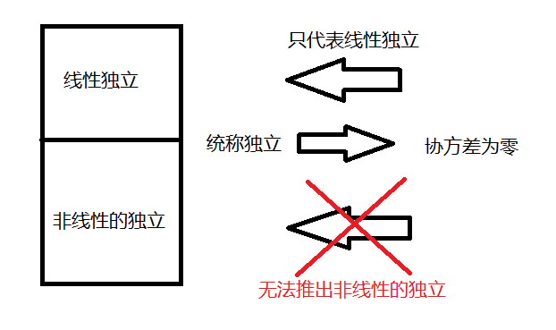

# 概率论

概率论在描述一个事件发生的频率这个问题上已经有了很长时间的研究，
比如拿一手特定的牌的可能性；
但是对于那些不可重复的问题，
比如医生判断一个病人得某种病的概率，
此时一个病人得病的概率是无法通过多次重复来进行验证，
此时的概率代表的是一种 **确信的程度（置信度，degree of belief）**。
前者衡量的事件发生的频率，可以被称为 **频率派概率（frequentist probability）**，
后者描述的是量化的确定度，可以被称为 **贝叶斯概率（Bayesian probability）**。

## 离散变量和概率质量函数

针对离散变量的变量状态到该状态发生的概率的映射，被称为 **概率质量函数（PMF）**。

它有以下特性：

- PMF的定义域是变量所有可能状态的集合
- 每种状态的概率介于0到1之间
- 每种状态的概率和为1

## 连续变量和概率密度函数

针对连续变量的，被称为 **概率密度函数（PDF）**。

## 条件概率

条件概率是指在其他事件发生时，我们感兴趣的事件发生的概率；
不要与某事发生后我们感兴趣的事件发生的概率混淆。
前者称为 **条件概率**，后者则是 **因果模型** 范畴下的 **干预查询**。

## 条件概率的链式法则

联合概率可以被分解为条件概率：

$$
P(x^{(1)}, ..., x^{(n)})
= P(x^{(1)}) \prod_{i = 2}^{n} P(x^{(i)} \mid x^{(1)}, ..., x^{(i - 1)}) 
$$ 

## 独立和条件独立

独立：

$$
\forall x \in \mathrm{x}, y \in \mathrm{y}, 
p(\mathrm{x} = x, \mathrm{y} = y) = p(\mathrm{x} = x) p(\mathrm{y} = y)
$$ 

条件独立：

$$
\forall x \in \mathrm{x}, y \in \mathrm{y}, z \in \mathrm{z},
p(\mathrm{x} = x, \mathrm{y} = y  \mid \mathrm{z} = z)
= p(\mathrm{x} = x  \mid \mathrm{z} = z) p(\mathrm{y} = y \mid \mathrm{z} = z)
$$ 

## 期望，方差，协方差

**期望** 可以看作是在一定概率分布下$f(x)$的均值。

$$
\mathbb{E}_{\mathrm{x} \sim P}[f(x)] = \sum_{x}^{} P(x)f(x)\\
\mathbb{E}_{\mathrm{x} \sim p}[f(x)] = \int p(x)f(x)dx
$$ 

**方差** 可以看作是在一个分布下，对不同的$x$进行采样$f(x)$变化幅度的描述。

$$
\mathop{\operatorname{Var}}(f(x)) = \mathbb{E}[(f(x) - \mathbb{E}[f(x)])^2]
$$ 

**协方差** 提供了一种描述两个值之间线性相关性强度以及这些变量尺度的值。

$$
\mathop{\operatorname{Cov}}(f(x), g(y)) = \mathbb{E}[(f(x) - \mathbb{E}[f(x)])
(g(y) - \mathbb{E}[g(y)])]
$$ 

当协方差的绝对值很大时，意味着这些变量都有较大的方差；
当为正时，意味着变量间呈现正相关；
当为负时，意味着变量间呈现负相关。

协方差与独立性是两个不同的概念：

- 协方差为0，意味着变量之间是线性独立的
- 独立性是个要求更严格的性质，不仅意味着线性独立，同时意味着非线性的独立
- 也就是说协方差为0，也有可能是非线性的相关+线性独立

协方差矩阵可以写为：

$$
\mathop{\operatorname{Cov}}(\mathrm{x})_{i, j} = \mathop{\operatorname{Cov}}(x_{i}, x_{j})
$$ 

其中随机向量$x \in \R ^{n}$，协方差矩阵为一个$n \times n$的矩阵。

协方差的对角元素是方差：

$$
\mathop{\operatorname{Cov}}(x_{i}, x_{i}) = \mathop{\operatorname{Var}}(x_{i})
$$ 

同时举个例子：

- $s$有$\frac{1}{2}$概率取$1$，有$\frac{1}{2}$概率取$-1$
- $x \sim U(0, 1)$
- $y = sx$

此时$\mathop{\operatorname{Cov}}(y, x) = 0$，但是明显可以看到$y, x$是相关的。

## 常用概率分布

### Multinoulli分布

称为 **范畴分布（categorical distribution）**。

该分布由向量$p \in [0, 1]^{k-1}$参数化，
$p^{(i)}$代表第$i$种状态的概率。
第$k$种状态的概率可以通过$1 - 1^{\mathrm{T}}p$得到，
其中$1$是一个元素全为一的向量。

### 高斯分布

高斯分布也称为正态分布。

$$
\mathcal{N}(x; \mu, \sigma^2) = \sqrt{\frac{1}{2 \pi \sigma^2}} 
\exp (-\frac{1}{2\sigma^2}(x - \mu)^2)
$$ 

当需要对概率密度函数求值的时候，通常需要对$\sigma$求平方取倒数。
需要频繁的计算概率密度时，同时为了更方便控制分布和保证精度
（也就是将$\sigma$变为一个参数，不断地更改），会使用下式：

$$
\mathcal{N}(x; \mu, \beta^{-1}) = 
\sqrt{\frac{\beta}{2 \pi}} \exp (-\frac{\beta}{2} (x - \mu)^2)
$$ 

在不知道变量的分布的时候，默认使用正态分布是一个很好的选择。
- 根据中心极限定理，可以知道很多的独立随机变量之和近似服从正态分布。
- 在所有可能的同方差的分布中，正态分布在实数上对最大数量的不确定性进行了编码，
也可以说是包含了最少的先验知识到模型中。

推广到$\R ^{n}$上，称为 **多维正态分布**，可以参数化表示为：

$$
\mathcal{N}(x; \mu, \Sigma) = 
\sqrt{\frac{1}{(2\pi)^n \mathop{\operatorname{det}}(\Sigma)}} 
\exp (-\frac{1}{2}(x - \mu)^{\mathrm{T}} \Sigma^{-1} (x - \mu))
$$ 

其中$\Sigma$为协方差矩阵。

上面的式子在参数化后计算效率并不是很好，因此取$\Sigma$的倒数来计算，
使用 **精度矩阵$\beta$** 来表示, $\Sigma^{-1} = \beta$：

$$
\mathcal{N}(x; \mu, \beta^{-1}) = 
\sqrt{\mathop{\operatorname{\frac{\mathop{\operatorname{det}}(\beta)}{(2\pi)^{n}}}}} 
\exp (-\frac{1}{2}(x - \mu)^{\mathrm{T}} \beta (x - \mu))
$$ 

通常将协方差矩阵固定为对角矩阵。一个更简单的版本是各向同性高斯矩阵，
其协方差矩阵就是一个标量乘上单位矩阵。
